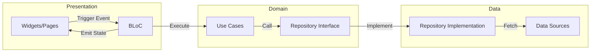

# 🚀 Flutter Clean Architecture & BLoC Starter

[](https://flutter.dev)
[](https://dart.dev)
[](https://blog.cleancoder.com/uncle-bob/2012/08/13/the-clean-architecture.html)
[](https://bloclibrary.dev)

Welcome to the `feature/starter-clean-bloc` branch. This branch serves as a robust foundation for Flutter applications using **Clean Architecture** principles combined with **BLoC** for state management.

---

## 🏛 Architecture & How it Works

The project follows a strict **Clean Architecture** pattern to decouple business logic from the UI and external data sources.

### 🔄 Data Flow (The BLoC Pattern)

The application follows a unidirectional data flow. Users interact with the **UI**, which triggers **Events**. The **BLoC** processes these events and interacts with **Use Cases** to perform business logic.



### 📦 Layer Breakdown

1.  **Presentation Layer**:
    *   **BLoC**: Orchestrates state changes. It listens for `Events`, communicates with `UseCases`, and emits `States`.
    *   **UI**: Purely visual. It uses `BlocBuilder` to react to state changes and `context.read<MyBloc>().add(Event())` to trigger actions.

2.  **Domain Layer (Pure Dart)**:
    *   **Entities**: Simple data objects that represent the business core.
    *   **Use Cases**: These are the "Command" patterns of your app. Each file should ideally contain only one use case (e.g., `LoginUser`).
    *   **Repository Interfaces**: Defines the "Contract" that the Data layer must fulfill.

3.  **Data Layer**:
    *   **Repository Implementations**: Logic for deciding whether to fetch from cache or network.
    *   **Data Sources**: Direct communication with APIs (Remote) or Local databases (Secure Storage).
    *   **Models**: Extensions of Entities with JSON serialization logic (`fromJson`, `toJson`).

---

## 🔐 Authentication Flow (Deep Dive)

The application implements a robust authentication check during the splash screen to ensure a seamless user experience.

### 1. Splash Initialization
When the app starts, the `SplashPage` is the initial route. After the first frame is rendered, it triggers the `init()` method:
- The native splash screen is removed.
- An `AuthRefreshRequested` event is dispatched to the `AuthBloc`.

### 2. Session Validation (`AuthRefreshRequested`)
The `AuthBloc` handles the `AuthRefreshRequested` event by:
1.  Emitting `AuthLoading` (if the UI needs to show a spinner).
2.  Executing the `RefreshSessionUseCase`.
3.  The Use Case calls the `IAuthRepository.refreshSession()`, which typically:
    - Retrieves the stored access token from `SecureStorage`.
    - Makes a network request to fetch the latest user profile and validate the token.
    - Updates local storage with the refreshed session data.

### 3. State Transition
Based on the result of the Use Case:
- **Success**: The `AuthBloc` emits `AuthAuthenticated(session)`.
- **Failure**: (e.g., token expired or no session found) The `AuthBloc` emits `AuthUnauthenticated()`.

### 4. Navigation Redirect
The `SplashPage` waits for the `AuthBloc` to reach a terminal state (`Authenticated` or `Unauthenticated`). Once reached:
1.  `getIt<AppStates>().isInitialized` is set to `true`.
2.  The `AppRouter` (using `GoRouter` redirect logic) detects the change in `AppStates` and `AuthBloc` state.
3.  The user is automatically navigated to:
    - **Home Page** if `AuthAuthenticated`.
    - **AuthFlow (Login/Onboarding)** if `AuthUnauthenticated`.

---

## 🔧 Core Mechanisms

### Dependency Injection (GetIt)
We use `GetIt` for service discovery. All dependencies (BLoCs, UseCases, Repositories) are registered once and injected where needed. This makes testing easier as you can easily swap implementations for mocks.

### Secure Storage
Sensitive data (tokens, user preferences) is managed via `SecureStorage` in `lib/core/storage/`. This ensures that even on rooted devices, the data remains encrypted.

### Error Handling
The `lib/core/error/` directory contains standard `Failure` and `Exception` classes. All `UseCases` return a `Result<T>` or a `Either` (depending on the implementation style) to ensure errors are handled explicitly at the presentation layer.

---

## 🚀 Getting Started

1.  **Clone & Install**:
    ```bash
    flutter pub get
    ```
2.  **Generate Code** (if applicable):
    ```bash
    flutter pub run build_runner build --delete-conflicting-outputs
    ```
3.  **Run Development**:
    ```bash
    flutter run --flavor development -t lib/main_development.dart
    ```

---

## 📘 Documentation

- [Quick Guide](QUICK_GUIDE.md) - How to add new features.
- [Official Setup SOP](https://docs.google.com/document/d/1C1Bp0MGl6SzpteSpHiG3OEZL_h7firR_a-HA8s8godM/edit?usp=sharing)
